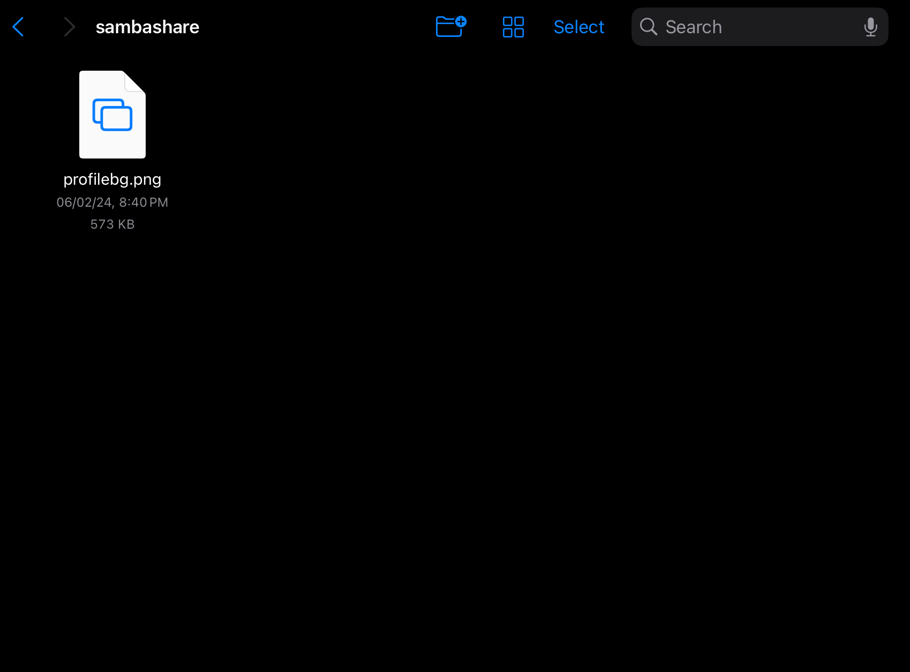

# Samba Server Setup

This project outlines the steps to set up a Samba server on a Linux system, allowing file sharing between your Linux machine and other devices on the same network.

## Prerequisites

- A Linux-based system (e.g., Ubuntu)
- Basic knowledge of terminal commands
- Administrator (sudo) access

## Installation and Configuration

### Step 1: Install Samba

`sudo apt install samba`

### Step 2: Create a Directory for Samba Share
 
`mkdir /home/<username>/sambaserver`

Replace `<username>` with your actual username.

### Step 3: Edit Samba Configuration File

Open the Samba configuration file using your preferred text editor:
 
`sudo nvim /etc/samba/smb.conf`

Add the following lines at the end of the file to create a new share:
 
```
[sambashare]
  path = /home/<username>/sambaserver
  read only = no
  browsable = yes
```

### Step 4: Restart Samba Service

`sudo systemctl restart smbd`

You can check status by 'systemctl status smbd'


### Step 5: Allow Samba Through Firewall

 
`sudo ufw allow smbd`

### Step 6: Set Samba Password for the User

`sudo smbpasswd -a <username>`

Then enter a password we would be using this to login from different devices.

Replace `<username>` with your actual username.

### Step 7: Verify Connectivity

Use the `ifconfig` command to check your IP address and ensure your devices can connect to the Samba share. You can verify the setup on your iPad and Android devices.

* * *

Screenshots
-----------
<div style="display:flex">
 
 
</div>

* * *

Additional Resources
--------------------

*   [Samba Documentation](https://www.samba.org/samba/docs)
*   [Ubuntu Samba Guide](https://help.ubuntu.com/community/Samba)

* * *


By following these steps, you should have a functional Samba server allowing file sharing between your Linux machine and other network devices.
